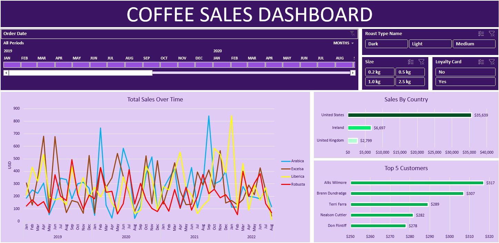

<h1 align="center">☕ Coffee Sales Analytics Dashboard</h1>

<p align="center">
  
  
  
  
</p>

<p align="center">
  An end-to-end Excel analytics project featuring data enrichment via advanced lookup functions,
  pivot-table modelling, and an interactive dashboard — covering <strong>$45,134</strong> in revenue
  across <strong>3 countries</strong> and <strong>4 coffee varieties</strong> over a 44-month period.
</p>

---

## 📸 Dashboard Preview



> *Interactive Excel dashboard with cross-filtering slicers for Roast Type, Package Size, and Loyalty Card status.*

---

## 📁 Project Structure

```
Coffee_Sales_Analysis/
├── RawDataset.xlsx              # Original transactional dataset (orders, customers, products)
├── coffeeOrdersProject.xlsx     # Processed workbook with enriched data + interactive dashboard
├── Coffee_Sales_Dashboard.png   # Dashboard screenshot export
├── Coffee_Sales_Report.docx     # Full written analytics report
└── README.md                    # Project documentation (this file)
```

---

## 🎯 Project Objectives

- **Enrich** a raw, incomplete transactional dataset using Excel lookup functions — no Power Query, no macros.
- **Model** sales data across time, geography, product, and customer dimensions using Pivot Tables.
- **Build** a fully interactive dashboard with dynamic slicers that stakeholders can filter in real time.
- **Derive** actionable business insights on revenue trends, market concentration, and customer behaviour.

---

## 📊 Key Results at a Glance

| Metric | Value |
|--------|-------|
| 💰 Total Revenue (44 months) | **$45,134** |
| 📦 Total Orders | **957** |
| 👤 Unique Customers | **913** |
| 🧾 Average Order Value | **$47.16** |
| 🌍 Markets Covered | USA · Ireland · UK |
| ☕ Coffee Varieties | Arabica · Excelsa · Liberica · Robusta |
| 📅 Best Full Year | **FY2021 — $13,766 (+13.6% YoY)** |
| 🏆 Top Performing Market | **USA — $35,639 (79.0% of revenue)** |
| 🥇 Top Coffee Variety | **Excelsa — $12,306 (27.3%)** |

---

## 🛠️ Tools & Techniques

### Microsoft Excel — Full Pipeline

| Stage | Techniques Used |
|-------|----------------|
| **Data Enrichment** | `XLOOKUP`, `INDEX/MATCH`, Nested `IF` |
| **Data Formatting** | Custom number formats (`$`, `0.0 kg`, `dd-mmm-yyyy`) |
| **Data Quality** | Duplicate checks, blank-cell handling for missing emails |
| **Aggregation** | 3× Pivot Tables (Sales Over Time · Country · Top Customers) |
| **Visualization** | Line chart (time series) · 2× Horizontal bar charts |
| **Interactivity** | 3× Slicers + 1× Timeline slicer — cross-filtered across all charts |

### Key Excel Functions Applied

```excel
-- Cross-table lookup: Customer Name, Email, Country, Loyalty Card
=XLOOKUP(C2, customers[Customer ID], customers[Customer Name])

-- Multi-column product lookup: Coffee Type, Roast Type, Size, Unit Price
=INDEX(products[Coffee Type], MATCH(D2, products[Product ID], 0))

-- Descriptive label mapping
=IF(I2="Rob","Robusta", IF(I2="Exc","Excelsa", IF(I2="Ara","Arabica","Liberica")))

-- Revenue calculation
= Unit Price × Quantity
```

---

## 📈 Key Insights

### 1. Revenue Trend (2019–2022)

| Year | Revenue | YoY Growth |
|------|---------|-----------|
| FY2019 | $12,187 | — (Baseline) |
| FY2020 | $12,118 | -0.6% |
| FY2021 | $13,766 | **+13.6%** ← Peak year |
| FY2022 | $7,063 | Partial (Jan–Aug only) |

> **September 2021** was the single-month revenue peak — Arabica alone hit **$841**.

### 2. Sales by Coffee Variety

| Variety | Revenue | Share | Avg Unit Price |
|---------|---------|-------|---------------|
| Excelsa | $12,306 | 27.3% | $14.29 |
| Liberica | $12,054 | 26.7% | $14.59 |
| Arabica | $11,768 | 26.1% | $12.28 |
| Robusta | $9,005 | 20.0% | $10.46 |

### 3. Geographic Breakdown

| Market | Revenue | Share |
|--------|---------|-------|
| 🇺🇸 United States | $35,639 | 79.0% |
| 🇮🇪 Ireland | $6,697 | 14.8% |
| 🇬🇧 United Kingdom | $2,799 | 6.2% |

### 4. Package Size Preference

> **52.7%** of all revenue comes from the **2.5 kg** package — indicating strong bulk-purchase behaviour.

| Size | Revenue | Share |
|------|---------|-------|
| 2.5 kg | $23,786 | 52.7% |
| 1.0 kg | $11,011 | 24.4% |
| 0.5 kg | $7,030 | 15.6% |
| 0.2 kg | $3,308 | 7.3% |

### 5. Roast Type Performance

| Roast | Revenue | Share |
|-------|---------|-------|
| Light | $17,354 | 38.5% |
| Medium | $14,600 | 32.3% |
| Dark | $13,179 | 29.2% |

### 6. Top 5 Customers by Lifetime Value

| Rank | Customer | Revenue |
|------|----------|---------|
| 🥇 | Allis Wilmore | $317 |
| 🥈 | Brenn Dundredge | $307 |
| 🥉 | Terri Farra | $289 |
| 4 | Nealson Cuttler | $282 |
| 5 | Don Flintiff | $278 |

> Top customers spend **~6× the average order value** ($47.16) — ideal candidates for a VIP loyalty programme.

---

## 📋 Dataset Overview

| Table | Records | Key Fields |
|-------|---------|-----------|
| `orders` | 1,000 rows | Order ID, Date, Customer ID, Product ID, Quantity |
| `customers` | 1,001 rows | Customer ID, Name, Email, Country, Loyalty Card |
| `products` | 48 rows | Product ID, Coffee Type, Roast Type, Size, Unit Price, Profit |

The raw `orders` table was incomplete — Customer Name, Email, Country, Coffee Type, Roast Type, Size, Unit Price, and Loyalty Card status were all populated during the enrichment phase using lookup functions against the `customers` and `products` dimension tables.

---

## 💡 Strategic Recommendations

1. **Market Diversification** — With 79% of revenue concentrated in the US, targeted campaigns in the UK could significantly improve geographic risk resilience.
2. **Robusta Repositioning** — At $10.46 avg unit price vs. $14.59 for Liberica, bundle promotions or upsell pathways could lift Robusta's revenue contribution.
3. **Bulk Purchase Incentives** — Introduce tiered pricing or subscription models for 2.5 kg buyers to deepen the dominant bulk-purchase trend.
4. **Loyalty Programme Redesign** — The near 50/50 card-holder revenue split (46.3% vs. 53.7%) signals low programme differentiation; a stronger reward structure could shift revenue toward higher-LTV retained customers.
5. **Email Data Completeness** — 187 customers (20.5%) have no email on record; closing this gap enables low-cost retargeting campaigns.
6. **Seasonality Planning** — June and March are the peak revenue months; aligning promotions and inventory to these peaks can maximise conversion.

---

## 📄 Full Report

A complete written analytics report is available in [`Coffee_Sales_Report.docx`](Coffee_Sales_Report.docx), covering:

- Executive Summary with KPI scorecard
- Data enrichment methodology & quality controls
- Revenue trend analysis with YoY breakdown
- Product, geographic, and customer segmentation
- Loyalty card analysis
- Strategic insights & actionable recommendations
- Technical appendix (functions, data model)

---

## 👤 About the Analyst

**Vu Tran Hai Long**  
Tools: Microsoft Excel — XLOOKUP · INDEX/MATCH · Pivot Tables · Slicers · Charts  
Reporting Period: January 2019 – August 2022 | Dataset: 1,000 transactions · 3 relational tables

> *This project demonstrates end-to-end Excel proficiency — from raw, incomplete data through structured enrichment to a fully interactive, stakeholder-ready dashboard.*

---

<p align="center">
  <i>⭐ If this project was useful, feel free to star the repository!</i>
</p>
